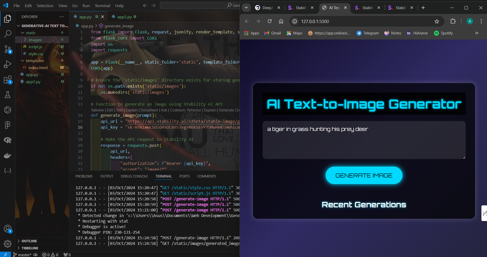
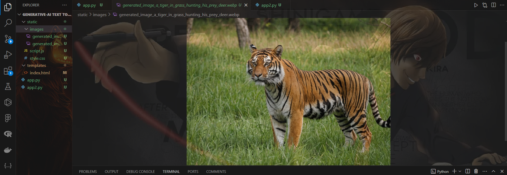

# AI Text-to-Image Generator

This project is an AI-powered application that converts text prompts into images using advanced deep learning models. The application uses two different APIs for testing and production: Stability.ai for testing purposes and Deep.ai for the actual model. The system allows users to input a description, and the model will generate an image based on that text.

## Tools and Technologies Used

- **Python**: The backend is written in Python.
- **Stability.ai API**: Used for testing purposes. The API key for this service is utilized in `app.py`.
- **Deep.ai API**: This will be the primary API for generating images in the final model. The API key for this service is referenced in `app2.py`.
- **Flask**: A lightweight WSGI web application framework for building the backend of the project.
- **HTML/CSS**: Used for building the front-end of the application.
- **JavaScript**: Utilized for handling the image generation requests from the client side and processing responses.

## How It Works

1. **User Input**: Users provide a description of the image they want to generate in a text field.
2. **Backend Processing**:
   - For testing, the input is sent to the Stability.ai API via the `app.py` file, which processes the text and returns an image.
   - For actual deployment, the input will be sent to the Deep.ai API via the `app2.py` file.
3. **Image Generation**: The generated image is then returned to the user, displayed on the webpage, and can be downloaded.

## API Keys

- **Stability.ai API Key**: Used in `app.py` for testing the image generation.
- **Deep.ai API Key**: Used in `app2.py` for the final version of the image generator.

## Screenshots

### Screenshot 1: User Interface


### Screenshot 2: Generated Image Example


## Technologies and Tools Used

<div style="display: flex; align-items: center; justify-content: space-around;">
    
    
    
    
</div>

- **Python**: Programming language used to develop the backend.
- **Flask**: Framework used for creating the web application.
- **Stability.ai**: API for testing text-to-image generation.
- **Deep.ai**: API for the production model of text-to-image generation.

## File Structure

```
.
├── app.py           # Backend using Stability.ai for testing
├── app2.py          # Backend using Deep.ai for actual image generation
├── templates/
│   └── index.html   # Frontend interface for user input
├── static/
│   ├── style.css    # CSS styles
│   └── script.js    # JavaScript for handling front-end actions
└── README.md        # This readme file
```

HAPPY CODING!!